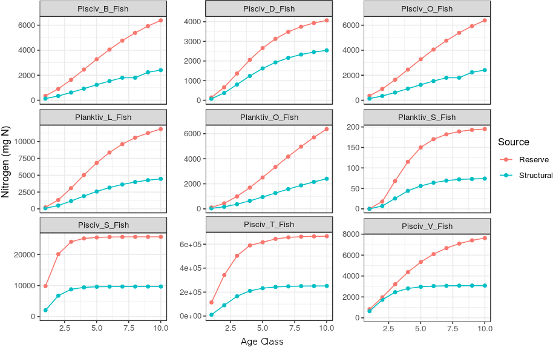
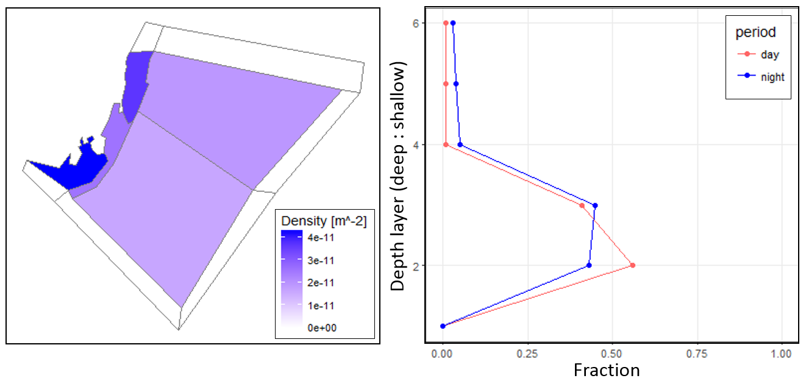
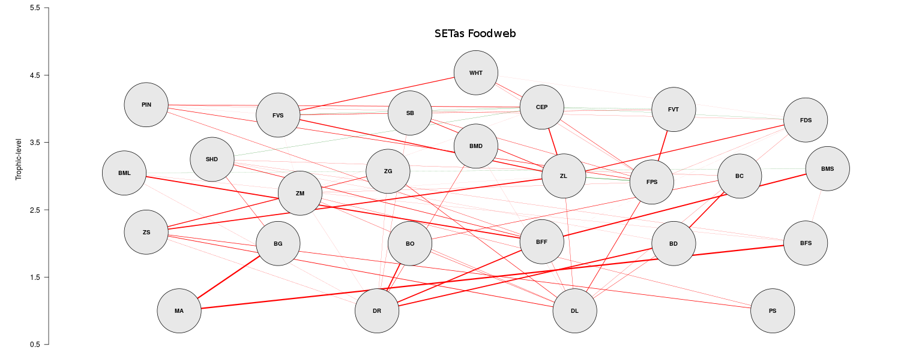
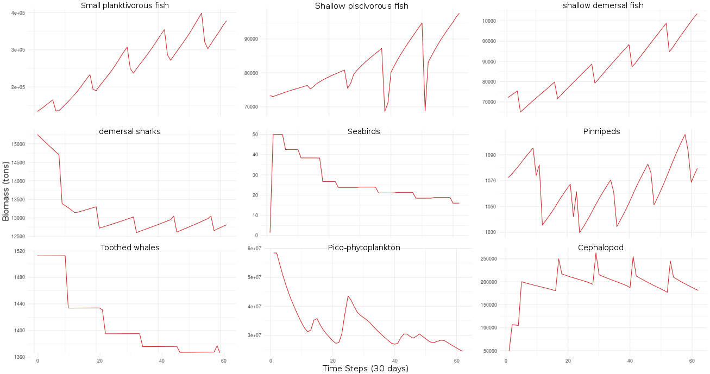
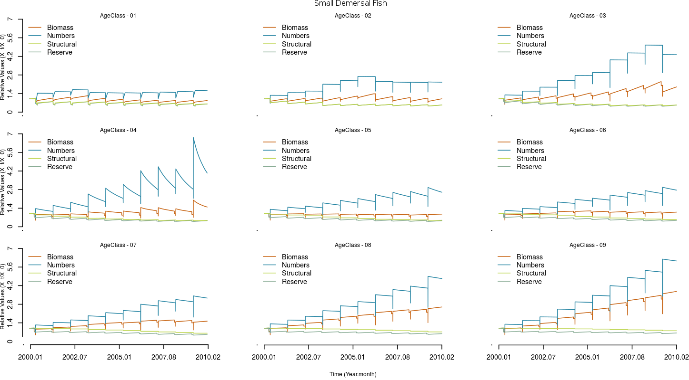

# Atlantis ecosystem model
Software for modelling marine ecosystem including spatial and temporal dynamics.

[Download manuscript](https://besjournals.onlinelibrary.wiley.com/journal/2041210x)

This page contains an example of an operational Atlatis model with details of the parameter (input) files and model output files given.
It also gives brief details and instructions on how to compile and run an Atlantis model on your computer.
For more detailed explanation about the code, the parameters and how to run Atlantis you will need to download the Atlantis manual
([part 1](https://research.csiro.au/atlantis/?ddownload=111) and [part 2](https://research.csiro.au/atlantis/?ddownload=112)). Other useful Atlantis references can also be found [here](https://research.csiro.au/atlantis/home/useful-references/).

<hr>

<p align="center">
    
</p>
<hr>


 **Attention!**
>Due to licensing requirements, new users must register to access the
code. If you want a copy of the Atlantis main code (which you will need to start using the
model) you will need to [email the developers](mailto:Javier.Porobicgarate@csiro.au) to get access to the [Atlantis-Wiki](https://confluence.csiro.au/display/Atlantis/Atlantis+Ecosystem+Model+Home+Page)
where you will need to sign the [licence agreement](https://confluence.csiro.au/display/Atlantis/CSIRO+licence+and+repository+request). 
From the [Atlantis-Wiki](https://confluence.csiro.au/display/Atlantis/Atlantis+Ecosystem+Model+Home+Page)
page you can access the code repository, detailed instructions, and operational examples. Here below is a synthesise of this information.
___

### Index
* [Example Operational Model](#example-operational-model)
   * [Input files and plots](#input-files)
   * [Output files and plots](#output-files)
   * [Software to anlyze inputs and outputs](#Software-to-analyze-input-and-output-files)
* [Model Instualation and Running](#Model-Installation-and-Running)
   * [Preparing your machine](#preparing-your-machine)
   * [Building Atlantis](#Building-Atlantis)
   * [Running Atlantis](#Running-Atlantis)
* [Instructions for Different Operating Systems](#Specific-instructions-for-your-Operating-Systems)
   * [Linux](#linux3)
   * [Windows](#Windows)
   * [MacOS](#MacOS)


# Example Operational Model

The best way to learn about a model, including it's input (parameter) files and outputs,
is through the illustration of an existing operational model.
The most used model example is the South East Tasmania (SETas) Atlantis model. This
 model is divided into 9 polygons and has 5 water layers and one sediment layer. It
 has 35 functional groups: 10 are structured by age, 23 are biomass pools,
 and three are detritus. This model is also forced by outputs from a hydrodynamic model that
 represent the flows between boxes, also includes forcing of salinity, temperature,
 fish catches, and arsenic concentration.

<p align="center">
    
</p>

## Input files
Here we provide a brief description of all the input files required to run an Atlantis model. For more details see the
Atlantis manual [part 1](https://research.csiro.au/atlantis/?ddownload=111) and [part 2](https://research.csiro.au/atlantis/?ddownload=112) or the [Atlantis-wiki](https://confluence.csiro.au/display/Atlantis/Atlantis+Ecosystem+Model+Home+Page).

> All the input files needed to run the SETas model can be downloaded [here](https://github.com/Atlantis-Ecosystem-Model/South_East_Tasmania_model/archive/master.zip).

### Essential files
* [**Functional_groups.csv**](https://github.com/Atlantis-Ecosystem-Model/South_East_Tasmania_model/blob/master/Functional_groups.csv) A file containing information about the functional groups in the model.
* [**Geography.bgm**](https://github.com/Atlantis-Ecosystem-Model/South_East_Tasmania_model/blob/master/Geography.bgm) The file defines the geography used in the Atlantis model to define the bathymetry of the model system.
* [**Run_settings.prm**](https://github.com/Atlantis-Ecosystem-Model/South_East_Tasmania_model/blob/master/Run_settings.prm) A file storing all the parameters defining the run setup (timestep, run and stop times, etc.).
* [**Physics.prm**](https://github.com/Atlantis-Ecosystem-Model/South_East_Tasmania_model/blob/master/Physics.prm) Physics parameters (coefficients) - apart from setting some flags (e.g. turning resuspension on/off), point-source scaling and quarterly eddy strength distribution these parameters are not typically changed.
* [**Forcings.prm**](https://github.com/Atlantis-Ecosystem-Model/South_East_Tasmania_model/blob/master/Forcings.prm) A file that lays out the forcing file pathways for hydrodynamics, point sources, climate time series (precipitation, irradiance, temperature and salinity), historical catch, fuel prices, GDP and complex spatial zonation.
* [**Biology.prm**](https://github.com/Atlantis-Ecosystem-Model/South_East_Tasmania_model/blob/master/Biology.prm) File detailing all the ecological parameters, submodel selection, network connection definitions and quarterly distributions.
* [**Fisheries.csv**](https://github.com/Atlantis-Ecosystem-Model/South_East_Tasmania_model/blob/master/Fisheries.csv) A file containing information about the fisheries in the model.
* **Initial_condition.nc** A NetCDF file where the initial conditions of the model are given,
such as the initial biomass and size values for each functional group and age structure
(access the plain text version [here](https://github.com/Atlantis-Ecosystem-Model/South_East_Tasmania_model/blob/master/Initial_condition.cdf)).

### Additional files (optional)
* **assess.prm** File detailing the sample design, sampling error structures and basic assessment model parameters.
* [**Harvest.prm**](https://github.com/Atlantis-Ecosystem-Model/South_East_Tasmania_model/blob/master/Harvest.prm) File storing all the fisheries and management parameters and submodel definitions.
* **econ.prm** A file storing all the socio-economics parameters (for the market model, trading model, and black-book based effort allocation model).
* [**time_serie.ts**](https://github.com/Atlantis-Ecosystem-Model/South_East_Tasmania_model/blob/master/inputs/catchts/catch1.ts) Optional forcing and input files with data columns for a particlar reference year (e.g. fisheries catch or solar radiation data).

## Visualisations of selected parameters used by the example SETas Atlantis model
### Inital reserve and structural biomasses (mg N) for selected functional groups

### Spatial (horizontal and vertical) distributions of functional groups
Initial distribution of one functional group



## Output files
Here we provide a brief description of all the output files from an Atlantis model. For more details see the
Atlantis manual
([part 1](https://research.csiro.au/atlantis/?ddownload=111) and [part 2](https://research.csiro.au/atlantis/?ddownload=112)).
### NetCDF output Files
Atlantis generates a number of NetCDF output files that contain spatial information
such as the biomass of functional groups in boxes and layers.  The NetCDF files do
not follow the normal gridded NetCDF structure that people are used to as the
Atlantis model is a box model, not a grid model. The normal packages such as
[ncview](http://meteora.ucsd.edu/~pierce/ncview_home_page.html) will not work with
Atlantis output NetCDF files. To read these outputs you can use your own code or one
of the tools listed [below](#Software-to-analyze-input-and-output-files).
*  **biol.nc**
Contains snapshots of the tracers in the model at given time frequencies in each box and layer.
*  **biolTOT.nc**
Contains a sum of the tracer values in each box and time-step.
*  **biolPROD.nc**
Useful during the model tuning process and contains 2D data (time, box) for each box.
It also contains the tracers for production and grazing for invertebrate groups, growth and consumption for each age class for each vertebrate group, and a number of indices such as the diversity index.
*  **CATCH.nc**
Contains cumulative values of catch and discard per species and age class (cohort) in numbers.
It also details catch and discards per species per fishery (in tonnes per box).
*  **TOTCATCH.nc**
This output files also contains cumulative total catch and discards per species in tonnes. All values are zeroed after they are written out.
*  **ANNAGEBIO.nc**
This output provides abundance in each annual age class (Numbers at age per species).
*  **ANNAGECATCH.nc**
Provides numbers at age per species in the catch and discards (summed over all fleets).

### Plain text files
These files can contains a simplified or aggregate version of the information
contained in the NetCDF files or and specific output.
##### Biologically relevant output:
*  [**BiomIndx.txt**](https://github.com/Atlantis-Ecosystem-Model/South_East_Tasmania_model/blob/master/output/BiomIndx.txt)
Biomass in tonnes of each species across the entire model domain
*  **DietCheck.txt**
Indication of diet pressure
*  **DetailedDietCheck.txt**
This file is only produced if flagdietcheck is set to 1. The file produced provides the total biomass
consumed of each prey species per age class of each predator species per box and layer. 
*  **YOY.txt**
This is the biomass in tonnes per spawning event summed over the total model domain.
##### Catch and fisheries relevant output
*  **BrokenStick.txt**
The output file that has been created to debug the broken stick management strategy.
*  **Catch.txt**
The total landings per species (in tonnes) across the entire model domain (summed over fisheries)
*  **CatchPerFishery.txt**
The catch of each species per fishery (in tonnes) across the entire model domain (summed over fisheries)
*  **Discards.txt**
The total discards per species across the entire model domain (summed over fisheries)
*  **DiscardsPerFishery.txt**
The discards of each species per fishery across the entire model domain (summed over fisheries)

## Example outputs for the SETas model
There are various tools that help visualise Atlantis output files and many users write their own codes.
These tools are listed [below](#Software-to-analyze-input-and-output-files).
Here we show a few example plots that can be produced with these tools.

> *Note: Refer to [**Functional_groups.csv**](https://github.com/Atlantis-Ecosystem-Model/South_East_Tasmania_model/blob/master/Functional_groups.csv)
for full names and descriptions of functional groups in the model.*

### Food web matrix (predator-prey interactions between functional groups)


### Biomass dynamics of selected functional groups


### Biomass dynamics by age class for one functional group (small demersal fish)


### Prey-predator interactions (biomass of prey consumed by small demersal fish on day 406)


## Software to analyze input and output files
To process and visualize inputs and output files of an Atlantis model, there exists a number of
software. Below we describe some widely used examples.

* [Atlantistools](https://github.com/alketh/atlantistools): Is a data processing and visualization tool for R, which helps to
process output from Atlantis models within R. Using atlantistools makes sure that
Atlantis users use the same input/output file structure which facilitates intra and
inter model comparisons.

* [ShinyRAtlantis](https://github.com/Atlantis-Ecosystem-Model/shinyrAtlantis): An
r-based shiny package that can be used to visually assess parameter values and
initial conditions of an Atlantis model.

* [ReactiveAtlantis](https://github.com/Atlantis-Ecosystem-Model/ReactiveAtlantis):
Reactive Atlantis has several tools that were created to help in the tuning,
parametrization and analysis of the processes and parameters most often modified
during the calibration of Atlantis. This tool was used to produce the figures above.

* [rbgm](https://github.com/AustralianAntarcticDivision/rbgm): Allows reading of
  geometry from BGM files, either in raw coordinate form or as Spatial objects.

* [angstroms](https://github.com/AustralianAntarcticDivision/angstroms): The goal of
  angstroms is to provide easy access to Regional Ocean Modeling System (ROMS) output
  for R.

Links to other software used can be accessed via the [Atlantis-Wiki](https://confluence.csiro.au/display/Atlantis/Atlantis+Helper+Tools).

<hr>

# Model Installation and Running

For detailed model installation and running instructions see chapter 2 in the [Atlantis manual Part I](https://research.csiro.au/atlantis/?ddownload=111).
Here we briefly describe the main steps involved.

## Preparing your machine
Atlantis can be run on Linux, windows, and MacOS operating systems. Depending on your operating system
Atlantis requires the a number of packages and libraries to be installed. This includes
software that operates as:
  1. A compiler (e.g. Visal Studio for windows or gcc for Linux).
  2. An SVN platform to check out the code (e.g. Tortoise SVN for windows or subversion for Linux).
  3. A NetCDF file system or development library (e.g. NetCDF 4 for windows).

  Please read the instructions for your operating system for more details [below](#Specific-instructions-for-your-operating-systems).

Code:
> *Note: Remember that if you want a copy of the Atlantis main code you will need to go
first to the [Atlantis-Page](https://confluence.csiro.au/display/Atlantis/CSIRO+licence+and+repository+request)
and sign the
[licence agreement](https://confluence.csiro.au/display/Atlantis/CSIRO+licence+and+repository+request)
 and then send an email to the developers, who will give you access to the
code.*

To download the code, the following URL link will need to be checked in by your SVN platform:

```
CSIRO users: https://svnserv.csiro.au/svn/atlantis/Atlantis/trunk/atlantis
External Partners: https://svnserv.csiro.au/svn/ext/atlantis/Atlantis/trunk/atlantis
```
## Building Atlantis
Once you have your compiler, NetCDF reader and source code, it is time to build
(upload and connect) your model files.

## Running Atlantis
At this stage you should be able to run an operational model
(such as that provided [above](#example-operational-model)), by calling a .sh or .bat file in the command line.

<hr>


# Specific instructions for your Operating Systems

## Linux
####  Checking libraries and packages
* **gcc** - GNU Compiler Collection
* **subversion** - Used to check out the code from the code repository
* **netcdf** Development library
* **libxml** Development library
* **proj** Development library - used for GIS projections
* **pkg-config** Can get by without this but it will be easier if you have it

```
$ dpkg -l | grep build-essential    # Essential packages to build Debian
$ dpkg -l | grep autoconf      	    # Automatic configure script builder
$ dpkg -l | grep subversion         # Version Control System (like GITHUB)
$ dpkg -l | grep gawk          	    # GNU version of Awk
$ dpkg -l | grep proj               # Program Proj.4 Cartographic projection
$ dpkg -l | grep libxml2-dev        # Library for XML language
$ dpkg -l | grep libnetcdf-dev      # Library of development kit for NetCDF
$ dpkg -l | grep flip               # convert text file line endings between Unix and DOS
```

#### Installing libraries and packages
In the case that you do not have any of the libraries or packages of the previous
point installed, this is the way to install them on your machine (using the terminal).

**Ubuntu**
```
$ sudo apt-get install build-essential
$ sudo apt-get install autoconf
$ sudo apt-get install subversion
$ sudo apt-get install libxml2-dev
$ sudo apt-get install libnetcdf-dev
$ sudo apt-get install gawk
```

**proj4**  install proj.4 following the instruction from developers [webpage](https://proj4.org/)

**Fedora**
```
$ yum install netcdf-devel  # Install the netcdf developer package
$ yum install subversion    # Install Subversion
$ yum install proj-devel    # Install the proj4 projection package
$ yum install libxml2-devel # Install the libxml developer package
$ yum install automake      # Install automake
$ yum install pkgconfig     # Install pkgconfig
```

> *Note: Most computers with other versions of Linux, follow similar instructions to install
the necessary packages and libraries. If you have questions, visit
[Wiki-Packages-Linux](https://confluence.csiro.au/display/Atlantis/Building+under+linux)*

#### Code
```
$ svn co https://svnserv.csiro.au/svn/ext/atlantis/Atlantis/trunk/atlantis
```

#### Build
So far we have built Atlantis, for Linux, on the following platforms: Ubuntu, Fedora,
CentOS, Debian 7.2, and Wheezy 64

We recommend 64-bit Ubuntu.

###### Instruction to build Atlantis under Ubuntu and Fedora.
```
$ cd  /to/your/atlantis/trunk/folder/
$ aclocal
$ autoconf
$ automake -a               # If you have problems with this section
$ autoreconf  -fvi          # you can use this command instead
$ sudo chmod +x configure   # Change the permissions to the configure script
$ ./configure
$ make
$ sudo make install
```
To build Atlantis in another versions of Linux please visit the
[Wiki-Building-Linux](https://confluence.csiro.au/display/Atlantis/Building+under+linux).

> Note: Before you can run the example Atlantis model under Linux you will need to convert the [input files](https://github.com/Atlantis-Ecosystem-Model/South_East_Tasmania_model/archive/master.zip) in Linux EOL format.
On your terminal navigate to your Atlantis model folder and then convert the files:
```
$ cd ~\You\Atlantis\Model\Folder\
$ flip -mv *
```

#### Run
 Create the bash application program file (**.sh**)
 - Open your plain text editor, such as gedit, emacs or nano. (e.g. *runAtlantis.sh*)
 - Add the commands to run Atlantis, which should have the following fortat:
   If you're using Ubuntu:
   ```
   #!/bin/bash
   atlantisMerged -i in.nc 0 -o output.nc -r run.prm -f force.prm -p physics.prm -b biol.prm -h harvest.prm -a assess.prm -e economics.prm -s functionalGroups.csv -d outputFolder
   ```
 - Open the terminal window, navigate to your model run
 directory that has the  **.sh**  file in it (and your Atlantis model), type the name of your
 **.sh** file and press ENTER.
   ```
   user@pc:~$
   user@pc:~$ cd Atlantis/run
   user@pc:~/Atlantis/run>  ./runAtlantis.sh
   ```
---

## Windows
#### Required software
1. The compiler - any of the following versions of Visual Studio will the compiler Visual C++
    * Visual Studio C++ 2008
    * Visual Studio C++ 2010
    * Visual Studio C++ 2012
    * Visual Studio C++ Express Edition

  You can download all these versions [here](https://visualstudio.microsoft.com/vs/older-downloads/)

> *Note: Atlantis will not compile using Visual Studio 2015*

2. A NetCDF development library

    Follow instructions to download [NetCDF 4](https://www.unidata.ucar.edu/software/netcdf/docs/winbin.html). For further information see the
[Atlantis-Wiki](https://confluence.csiro.au/display/Atlantis/NetCDF+4+in+Windows)

3. An SVN platform to check out the source code from the code repository

    Dowload [TortoiseSVN](http://tortoisesvn.tigris.org/) as the preferred GUI.


#### Build
Building in Visual Studio requires opening the appropriate visual studio solution in
the root Atlantis SVN repository folder.
* Visual Studio 2008 uses atlantis_VS2008.sln
* Visual Studio 2010 uses atlantis_VS2010.sln
* Visual Studio 2012 uses atlantis_VS2012.sln

Step 1: In Visual Studio, right click on the atlantis solution and select ‘Rebuild all’. The
build process should show all projects succeeding with 0 failings.

Step 2: The executable file *atlantismain.exe* should then be copy from the
atlantismain/Debug folder to the folder where your model run files are kept.

For more details on the building process, including how to fix common errors,
visit [Wiki-Building-Windows](https://confluence.csiro.au/display/Atlantis/Building+under+windows).

#### Code
To locally compile the code, create a new folder or checkout directory for your
source code (e.g. c:\Code\atlantis). Right click in this new folder and select the
new menu option  **"SVN checkout"** and enter the appropriate URL of repository:
```
CSIRO users: https://svnserv.csiro.au/svn/atlantis/Atlantis/trunk/atlantis
External Partners: https://svnserv.csiro.au/svn/ext/atlantis/Atlantis/trunk/atlantis
```

You will then be asked to authenticate using your domain username and password
provided after registering to be a user.


#### Run
 Create the batch file (**.bat**)
 - Open your plain text editor (e.g. Textpad, Notepad or WordPad) and save (e.g. *runAtlantis.bat*)
 - Add the commands to run Atlantis, which should have the following format:
   ```
   atlantis -i in.nc 0 -o output.nc -r run.prm -f force.prm -p physics.prm -b biol.prm -h harvest.prm -a assess.prm -e economics.prm -s functionalGroups.csv -d outputFolder
   ```
 Open the dos command prompt window, navigate to your model run
 directory that has the *.bat* files in it (and the *.exe*  file if you have not
 formally installed Atlantis to the command line paths), type the name of your *.bat*
 file and press ENTER.
 ```
 C:\> cd Atlantis\run
 C:\Atlantis\run$  runAtlantis.bat
 ```

---
## MacOS
##### Important
> We would not recommend using Mac if you have a choice. It generally takes a couple
of hours and as much as a day per machine to set up. Its not as simple as running on
windows or Linux and you will need to be comfortable installing libraries from
source.

#### Compiler
* [Xcode](https://developer.apple.com/xcode/): To install Xcode you might download
a dgm file. Once this is downloaded open Finder and drag the Xcode folder into your
applications to install it. Once its finished installing you need to eject it before
you delete it from your downloads folder. Then you might need to type something like
the following:
```
$ sudo xcode-select -switch /Applications/Xcode.app/Contents/Developer
```

* **GCC** : You should use gcc-7, prior to high sierra it was gcc-4.6. You can install this
using [macports](http://www.macports.org/) or [homebrew](http://brew.sh/).

#### Required libraries
Atlantis needs the following libraries to be installed. For each library download the most recent stable versions.

* **autoconf**  Automatic configure script builder. Download using macports.
* **automake** Automatic make script builder. Download using macports.
* [**Netcdf** Development library](http://www.unidata.ucar.edu/downloads/netcdf/index.jsp).
* [**proj4** Development library](http://trac.osgeo.org/proj/), used for GIS projections. Make sure you get version 4.7.0.
* **pkgconfig** Helper tool used when compiling applications and libraries. Download using macports or from [freedesktop](http://www.freedesktop.org/wiki/Software/pkg-config).
* [**libxml**](http://www.xmlsoft.org/) - Library to deal with xml files format.

All of the following libraries should be downloaded to a folder such as /home/Downloads
To install the library "libname" you should do :
* Unpacked using:
```
$ gzip -dv libname.tar.gz
$ tar -xvf libname.tar
```
* Then cd into the libname dir
```
$ cd libname
```
* Then configure the library and install
```
$ ./configure
$ make
$ sudo make install
```

#### Build
Initially,  to include all the source code you will need to build
the code via command line rather than using other developer software (e.g. eclipse ).
In the Atlantis code there is a file called *configure_mac*,  you will probably need
to edit this file to point to each of the locations of the libraries you have
installed. In the following instructions substitute  *configure_N* with the name of
the custom *configure_mac* file you have created.

Open a terminal and go to where your source code is and type:
```
$ aclocal
$ autoheader
$ autoconf
$ automake -a
$ ./configure_N
make
```
This will hopefully build an executable called atlantisNew in the atlantismain
folder. If it doesn't work you will probably need to edit the configure_N script you
have created to point to the correct folders or check the libraries are correctly
installed.

```
$ sudo make install
```
This will install the Atlantis header files and the executable in /usr/local/include/Atlantis-1.0/Atlantis and /usr/local/bin

More detailed information bout how to build Atlantis can be found in the [Wiki-Building-MacOS](https://confluence.csiro.au/display/Atlantis/Building+under+mac).


#### Run
 Create the bash application program file (**.sh**)
 - Open your plain text editor, such as gedit, emacs or nano. (e.g. *runAtlantis.sh*)
 - Add the commands to run Atlantis, which should have the following fortat:

   If Your are using Ubuntu
   ```
   #!/bin/bash
   atlantisMerged -i in.nc 0 -o output.nc -r run.prm -f force.prm -p physics.prm -b biol.prm -h harvest.prm -a assess.prm -e economics.prm -s functionalGroups.csv -d outputFolder
   ```
   If Your are using MacOS
   ```
   #!/bin/bash
   atlantis -i in.nc 0 -o output.nc -r run.prm -f force.prm -p physics.prm -b biol.prm -h harvest.prm -a assess.prm -e economics.prm -s functionalGroups.csv -d outputFolder
   ```
 Open the terminal window, navigate to your model run
 directory that has the  **.sh**  file in it (and your Atlantis model), type the name of your
 **.sh** file and press ENTER.
   ```
   user@pc:~$
   user@pc:~$ cd Atlantis/run
   user@pc:~/Atlantis/run>  ./runAtlantis.sh
   ```

<a name="win3">
